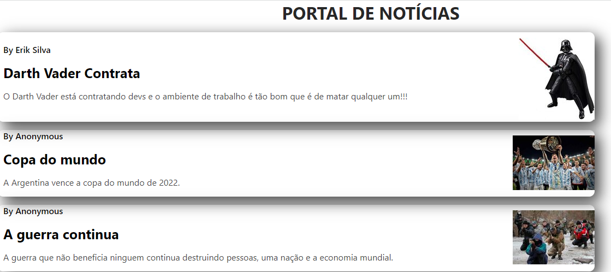

MODELO DE README

# COMPONENT SHADOW 

> Output

- Esse projeto criado durante a introdução do Bootcamp Angular tem a funcionalidade de manipular dados em Javascript em componente fantasma (Shadow DOM) e retornar HTML, CSS e JS para o console como um Portal de Notícias. Em projeto de equipe pode ser acessado por qualquer um e pode usá-lo como uma capsula dentro do projeto sem alterar outros dados.

[🔗clique aqui para acessar projeto completo](https://github.com/eriksilva01/shadow-dom.git)

#  🛠 Tecnologias
- HTML
- CSS
- JS
- GitHub

# 📩Contato
eriksilva.dev@hotmail.com
